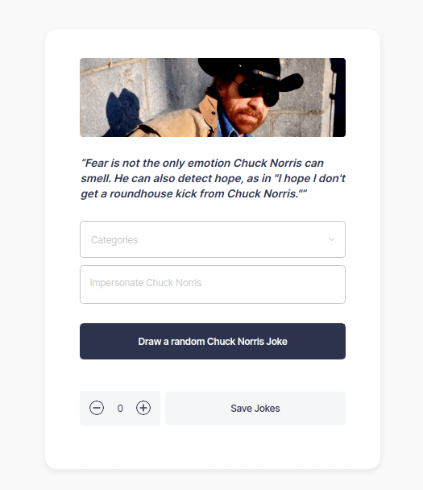

<h1 align="center">Chuck Norris Joke</h1>

  <h3>
    <a href="https://chuck-norris-joke-daniel.netlify.app/">
      Demo
    </a>
     | 
    <a href="https://github.com/voromahery/chuck_norris_jokes_daniel">
      Solution
    </a>
  </h3>

<!-- TABLE OF CONTENTS -->

## Table of Contents

- [Overview](#overview)
  - [Built With](#built-with)
- [Features](#features)
- [How to use](#how-to-use)
- [Contact](#contact)
- [Acknowledgements](#acknowledgements)

<!-- OVERVIEW -->

## Overview

- Click this link to see my app [Chuck Norris Joke](https://chuck-norris-joke-daniel.netlify.app/) :

## [Acknowledgements](#acknowledgements)

This single page application displays a random Chuck Norris Joke. Chuck Norris can be impersonated by using the input. The select is used to display a random joke depending on the selected category.

The counter is created in order to print multiple jokes.

## [Built With](#built-with)

- [CSS](https://developer.mozilla.org/en-US/docs/Web/CSS)
- [React](https://reactjs.org/)
- [TypeScript](https://www.typescriptlang.org/)

## [Features](#feature)

- [The internet Chuck Norris Database](http://www.icndb.com/api/)

## [How to use](#how-to-use)

### Clone this repository

`$ git clone https://github.com/voromahery/chuck_norris_jokes_daniel.git`

### Install dependencies

`$ npm install`

### Run the app

`$ npm start`

## Contact

- Email: daniel.her@onja.org
- GitHub [voromahery](https://github.com/voromahery)
